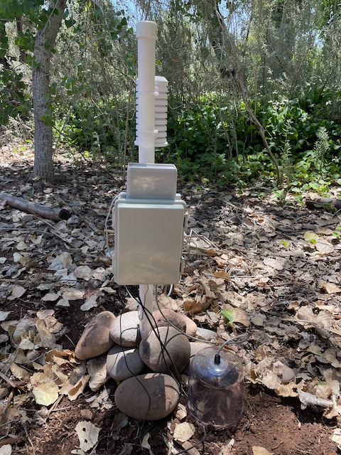
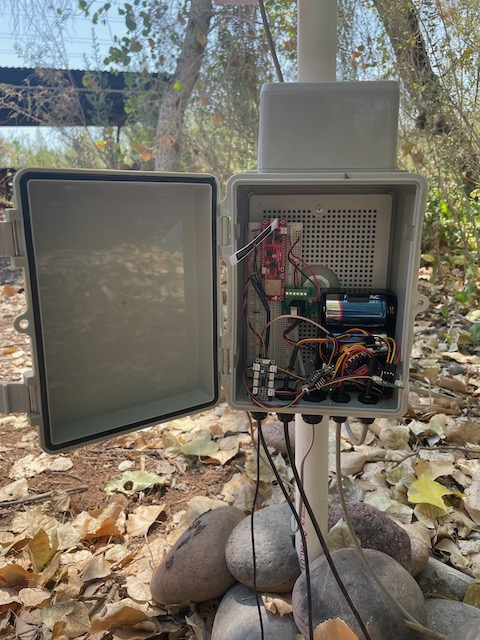
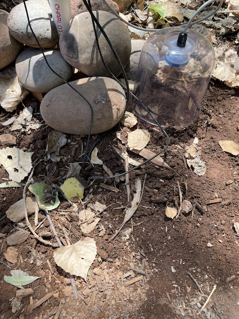
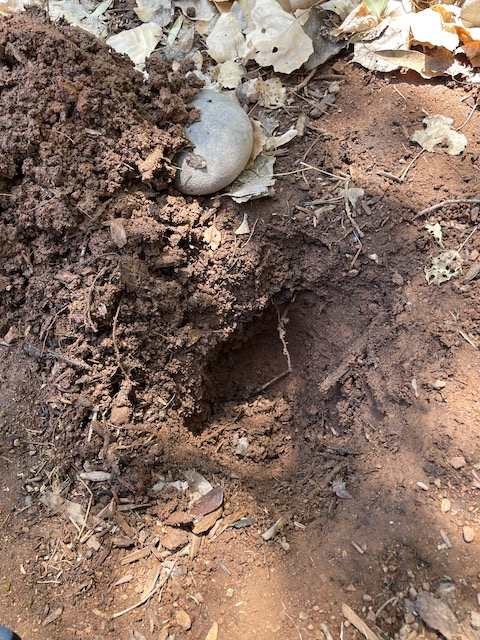
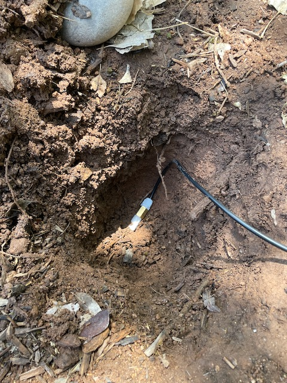
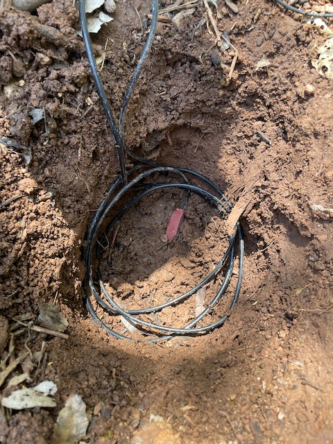
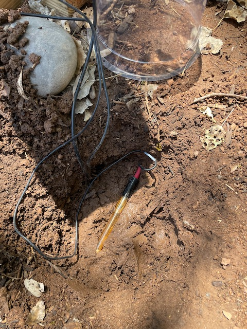
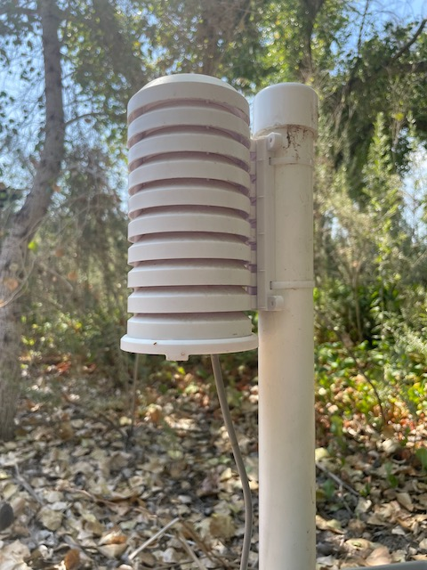
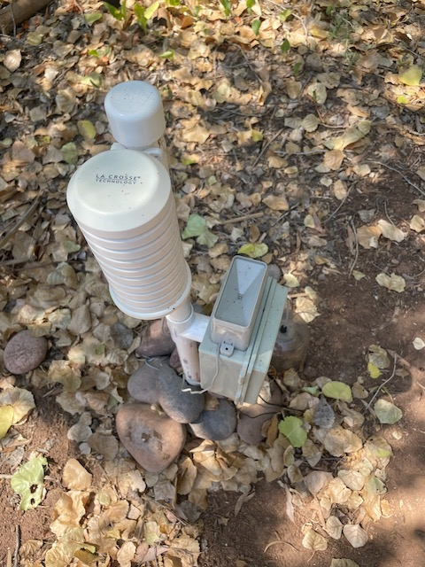

# Environmental Node for Mycorrhizal Research
## Project Overview
This repository contains the code and hardware specifications for an environmental node designed to collect and publish data for mycorrhizal research. The project is a collaboration between Glyxon Biolabs and the Desert Botanical Gardens, aimed at studying the mutual interaction between soil fungi and trees in challenging environments.
## Background
Mycorrhizal communities form a fundamental mutualistic interaction between soil fungi and trees. However, the interaction between soil bacteria and mycorrhizal fungi is still largely unknown. These microorganisms play crucial roles in carbon and nitrogen fixation. Our project implements a biosensor device to assess the spatiotemporal distribution of mycorrhizal-bacterial species and how their diversity and abundance affect trees grown in challenging environments.
## Hardware Components
The environmental node consists of the following sensors:

CO2 sensors (for soil chamber and air)
Soil moisture sensor
Soil temperature sensor
Soil pH sensor
Air temperature and humidity sensors (for chamber and ambient air)
Rain tipping bucket

## Features

In-situ data collection
MQTT protocol for data publishing
Grafana integration for data visualization
Cellular connection for remote data transmission
Modular design for easy maintenance and upgrades

## Data Collected
The node collects the following environmental data:

CO2 levels (soil chamber and ambient air)
Soil moisture
Soil temperature
Soil pH
Air temperature (chamber and ambient)
Air humidity (chamber and ambient)
Rainfall

## Installation
[step-by-step instructions for setting up the hardware and software]

## Usage
[how to use the node, calibration procedures, data collection intervals, and how to access the data]
## Data Analysis
[information on how to access and analyze the data, including any scripts or tools included in the repository]
## Contributing
We welcome contributions to this project. Please read our CONTRIBUTING.md for details on our code of conduct and the process for submitting pull requests.
## License
[license under which this project is released]
## Acknowledgements
This project is a collaboration between Glyxon Biolabs and the Desert Botanical Gardens. We would like to thank all researchers and contributors involved in this study.
Contact
[contact information for the project maintainers]

## Hardware

## Software

## Pictures
 

